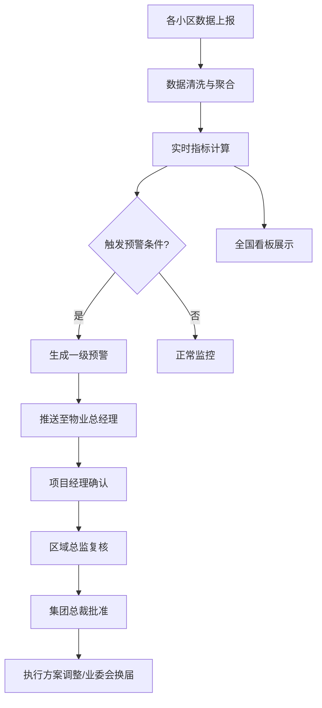

## 1. 产品概述

全国性住宅小区综合运营与业主智能服务分析平台，面向物业集团、区域公司和小区项目管理团队，实时汇聚门禁、电梯、安防、维修、缴费、投票及投诉等全域数据，通过智能分析与预警机制驱动物业服务品质提升和业主满意度改善。

- 核心目标：实现小区运营数据实时可视、异常自动预警、审批流程线上化、服务差距量化对比
- 目标用户：物业集团总裁/高管、区域总监、项目经理、业主委员会成员

## 2. 核心功能

### 2.1 用户角色

| 角色 | 登录方式 | 核心权限 |
|------|----------|----------|
| 集团管理员 | 账号密码+MFA | 查看全国所有小区数据、审批集团级决策、导出全量报表 |
| 区域总监 | 账号密码 | 查看所辖区域小区数据、复核区域审批事项 |
| 项目经理 | 账号密码 | 查看所辖小区数据、确认预警事项、提交服务方案调整 |
| 业主委员会 | 账号密码 | 查看本小区公开数据、参与投票、提交投诉 |

### 2.2 功能模块

1. **全国看板页**：省份切换、满意度热力图、设备故障排名、核心指标卡片
2. **小区详情页**：楼栋投诉趋势曲线、设备维修时间线、物业费收缴分析、满意度详情
3. **预警中心页**：预警列表、预警详情、三级审批流程、服务方案调整记录
4. **合同分析页**：上传物业服务合同/年度预算Excel、自动提取服务标准、实际对比与异常提醒
5. **运营报告页**：周报自动生成、收缴率同比环比、投诉类型分布、设备维护响应时长、优化建议
6. **权限管理页**：集团/区域/小区三级组织架构、角色分配、数据范围控制

### 2.3 页面详情

| 页面名称 | 模块名称 | 功能描述 |
|----------|----------|----------|
| 全国看板页 | 核心指标卡片 | 实时显示设备完好率、物业费收缴率、投诉响应及时率、业主满意度 |
| 全国看板页 | 省份切换导航 | 支持按省份筛选，切换后热力图和排名联动更新 |
| 全国看板页 | 满意度热力图 | 全国地图按省份着色展示满意度分布，鼠标悬浮显示详情 |
| 全国看板页 | 设备故障排名 | 列表展示故障率最高的小区Top20，支持点击下钻 |
| 全国看板页 | 预警概览 | 实时显示当前各级预警数量，点击进入预警中心 |
| 小区详情页 | 基本信息卡片 | 小区名称、地址、物业公司、楼栋数、户数等基础信息 |
| 小区详情页 | 楼栋投诉趋势 | 近7天各楼栋投诉量折线图，按楼栋分色展示 |
| 小区详情页 | 设备维修时间线 | 甘特图/时间线展示设备故障到修复的全流程 |
| 小区详情页 | 物业费收缴分析 | 月度收缴率柱状图，标注预警线(70%) |
| 小区详情页 | 满意度雷达图 | 多维度满意度评估（安保、保洁、维修、响应速度等） |
| 预警中心页 | 预警列表 | 按级别/状态/时间筛选预警记录，显示触发条件和当前状态 |
| 预警中心页 | 审批流程面板 | 三级审批流程可视化：项目经理确认→区域总监复核→集团总裁批准 |
| 预警中心页 | 方案调整记录 | 服务方案调整历史、业主委员会换届记录 |
| 合同分析页 | 文件上传区 | 支持上传物业服务合同PDF和年度预算Excel |
| 合同分析页 | 服务标准提取 | 自动解析合同中服务标准条款和预算数据 |
| 合同分析页 | 差异对比表 | 服务标准vs实际表现对比，差距超15%红色标注异常 |
| 运营报告页 | 周报概览 | 自动生成的运营诊断报告核心摘要 |
| 运营报告页 | 收缴率分析 | 同比环比趋势图、影响因素分析 |
| 运营报告页 | 投诉分析 | 投诉类型饼图、处理时长分布、高频投诉词云 |
| 运营报告页 | 设备维护分析 | 响应时长统计、故障频次排名、维护成本概览 |
| 运营报告页 | 优化建议 | 基于数据对比上周自动推荐服务流程和人员配置优化建议 |
| 权限管理页 | 组织架构树 | 集团→区域→小区三级树形结构管理 |
| 权限管理页 | 角色分配 | 为用户分配角色和数据查看范围 |

## 3. 核心流程

### 3.1 数据接入与聚合流程
1. 各小区IoT设备（门禁、电梯、安防）和业务系统（缴费、投诉、投票）实时上报数据
2. 数据清洗层自动去除重复、异常数据，按小区/物业公司/行政区聚合
3. 实时计算核心指标：设备完好率、物业费收缴率、投诉响应及时率、业主满意度

### 3.2 预警触发与审批流程
1. 系统自动检测：连续3个月收缴率<70% 或 设备故障率>5%
2. 自动生成一级预警，推送至物业公司总经理
3. 启动三级审批：项目经理确认事实→区域总监复核方案→集团总裁批准决策
4. 审批通过后执行服务方案调整或启动业委会换届

### 3.3 合同对比流程
1. 上传物业服务合同和年度预算Excel
2. 系统自动提取服务标准条款和预算数据
3. 与实际运营数据对比，差距超15%生成异常提醒
4. 差异报告推送至相关负责人

## 4. 用户界面设计

### 4.1 设计风格
- **主色调**：深海蓝(#0F2B46) + 科技青(#00D4AA)作为强调色，搭配暗色系背景营造专业数据平台质感
- **辅助色**：预警红(#FF4D4F)、警示橙(#FAAD14)、正常绿(#52C41A)
- **字体**：标题使用思源黑体(Noto Sans SC) Bold，正文使用思源黑体 Regular，数据数字使用DIN Pro
- **布局风格**：左侧导航+顶部筛选栏+主内容区的经典数据平台布局，卡片式模块化设计
- **图标风格**：线性图标，2px线宽，圆角端点，科技感统一风格
- **按钮风格**：圆角8px，主按钮实心填充，次按钮描边，悬浮微动效

### 4.2 页面设计概览

| 页面名称 | 模块名称 | UI要素 |
|----------|----------|--------|
| 全国看板页 | 核心指标卡片 | 深色卡片、大号DIN数字、趋势箭头、微妙渐变背景 |
| 全国看板页 | 满意度热力图 | 中国地图SVG、省份渐变着色、悬浮浮层详情 |
| 全国看板页 | 设备故障排名 | 横向条形图、红橙渐变色带、排名数字高亮 |
| 小区详情页 | 楼栋投诉趋势 | 多色折线图、7天横轴、网格线、数据点悬浮 |
| 小区详情页 | 设备维修时间线 | 垂直时间线、状态色点、故障→修复时长条 |
| 预警中心页 | 审批流程 | 步骤条组件、当前步骤高亮、审批人头像、时间戳 |
| 合同分析页 | 差异对比表 | 表格行交替色、超15%差异红色高亮、正常绿色勾 |
| 运营报告页 | 综合图表 | 柱状图+折线图混合、饼图、雷达图、词云 |

### 4.3 响应式设计
- 桌面端优先（1920×1080为主要适配分辨率）
- 支持缩至1440宽度正常使用
- 平板端简化侧边栏为折叠模式
- 移动端仅支持核心看板和预警推送查看

### 4.4 3D场景
- 不适用，本平台为2D数据可视化分析平台
