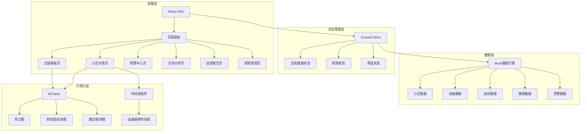
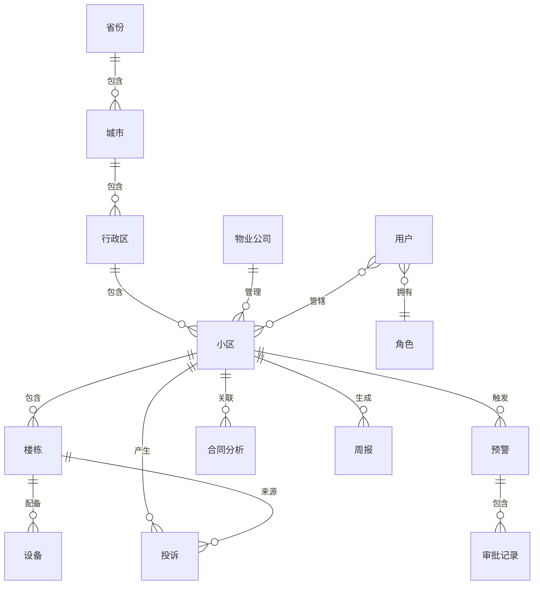

## 1. 架构设计



## 2. 技术说明

- **前端框架**：React@18 + TypeScript + Vite
- **初始化工具**：vite-init (react-ts模板)
- **样式方案**：Tailwind CSS@3
- **状态管理**：Zustand
- **路由**：react-router-dom@6
- **图表库**：ECharts@5 (echarts-for-react封装)
- **地图可视化**：ECharts中国地图（内置省份GeoJSON）
- **文件解析**：xlsx (SheetJS) 用于解析Excel，pdfjs-dist 用于PDF文本提取
- **后端**：无后端，使用Mock数据模拟
- **数据库**：无数据库，前端Mock数据

## 3. 路由定义

| 路由 | 用途 |
|------|------|
| / | 重定向至 /dashboard |
| /dashboard | 全国看板页：核心指标、满意度热力图、设备故障排名 |
| /community/:id | 小区详情页：投诉趋势、维修时间线、收缴分析 |
| /alerts | 预警中心：预警列表、审批流程 |
| /contracts | 合同分析页：文件上传、标准对比 |
| /reports | 运营报告页：周报、同比环比分析 |
| /admin | 权限管理页：组织架构、角色分配 |
| /login | 登录页：账号密码登录 |

## 4. API定义

本项目为纯前端项目，使用Mock数据。定义数据接口类型如下：

```typescript
interface Community {
  id: string
  name: string
  province: string
  city: string
  district: string
  propertyCompany: string
  buildings: number
  households: number
  equipmentIntactRate: number
  feeCollectionRate: number
  complaintResponseRate: number
  satisfactionScore: number
  equipmentFailureRate: number
  feeHistory: MonthlyFeeData[]
}

interface Alert {
  id: string
  communityId: string
  type: 'fee' | 'equipment'
  level: 1 | 2 | 3
  title: string
  description: string
  triggerDate: string
  status: 'pending' | 'confirmed' | 'reviewed' | 'approved' | 'resolved'
  approvals: ApprovalRecord[]
}

interface ApprovalRecord {
  step: number
  role: string
  assignee: string
  status: 'pending' | 'approved' | 'rejected'
  timestamp?: string
  comment?: string
}

interface ComplaintRecord {
  id: string
  communityId: string
  buildingId: string
  type: string
  description: string
  status: 'pending' | 'processing' | 'resolved'
  createdAt: string
  resolvedAt?: string
}

interface EquipmentRecord {
  id: string
  communityId: string
  buildingId: string
  type: string
  name: string
  status: 'normal' | 'fault' | 'repairing'
  faultDate?: string
  repairDate?: string
  completedDate?: string
}

interface ContractAnalysis {
  id: string
  communityId: string
  contractFile: string
  budgetFile: string
  standards: ServiceStandard[]
  comparisons: StandardComparison[]
}

interface ServiceStandard {
  category: string
  standard: string
  target: number
  unit: string
}

interface StandardComparison {
  category: string
  standardValue: number
  actualValue: number
  deviation: number
  isAbnormal: boolean
}

interface WeeklyReport {
  id: string
  communityId: string
  weekStart: string
  weekEnd: string
  feeCollectionYoY: number
  feeCollectionMoM: number
  complaintTypeDistribution: Record<string, number>
  avgMaintenanceResponseHours: number
  suggestions: string[]
}

interface User {
  id: string
  name: string
  role: 'group_admin' | 'regional_director' | 'project_manager' | 'owner_committee'
  region?: string
  communityIds: string[]
}
```

## 5. 服务器架构图

不适用（纯前端项目，无后端服务）

## 6. 数据模型

### 6.1 数据模型定义



### 6.2 数据定义

本项目使用前端Mock数据，无需DDL语句。Mock数据结构涵盖：
- 31个省份的小区分布数据
- 200+个小区的基础信息和运营指标
- 各小区近12个月物业费收缴历史
- 近7天各楼栋投诉记录
- 设备故障与维修记录
- 预警及审批流程数据
- 合同服务标准对比数据
- 周报生成数据
